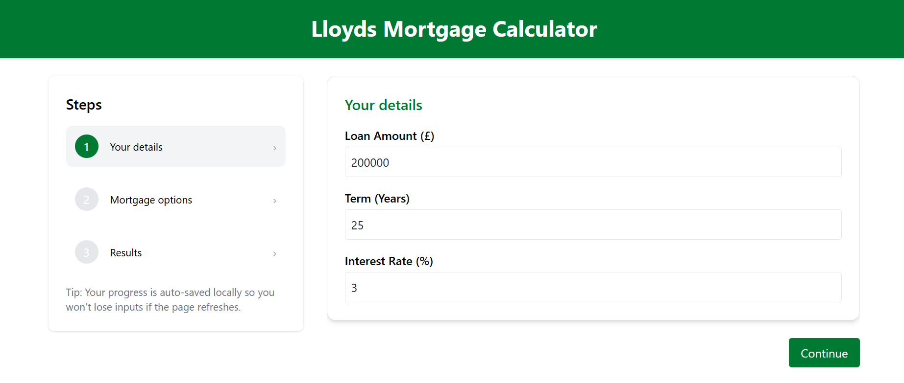

This project is a small prototype mortgage calculator built as part of a job simulation exercise for the Forage "Lloyds Banking Group - Technology Engineer" simulation.
# Lloyds Mortgage Prototype (Forage Job Simulation)




This repository contains a small prototype mortgage calculator built as part of the Forage "Lloyds Banking Group - Technology Engineer" simulation.

Purpose
- Demonstrate a multi-step wizard UI for entering mortgage details.
- Show safe mortgage calculations and a simple visualisation (pie chart).
- Implement accessibility and UX improvements: autosave, input validation, and animated transitions.

How to run
1. Install dependencies:

```powershell
npm install
```

2. Start the dev server:

```powershell
npm run dev
```

Notes
- This is a prototype for learning and demonstration only. It is not an official Lloyds product or financial advice.
- The project stores inputs in `localStorage` for convenience; do not use this behaviour for sensitive data in production.

License & attribution
- Created for the Forage Lloyds Banking Group Technology Engineer simulation.
